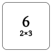
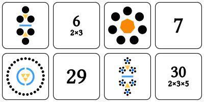

% Factorization diagrams

    [BLOpts]
    profile    = mlt
    postid     = 2208
    publish    = true
    page       = true
    tags       = factorization, diagrams, visualization, beauty, recursion
    categories = arithmetic, counting, geometry, links, "number theory", pattern, pictures, primes

```{.dia width='400'}
import Diagrams.TwoD.Factorization

dia = fdGrid [[30..36]]
```

This page collects information and links about *factorization
diagrams*, as
[seen on Hacker News](https://news.ycombinator.com/item?id=4620071)
and
[the cover of Hacker Monthly #31](http://hackermonthly.com/issue-31.html).

 <div style="text-align:center; border: 2px solid black; border-radius: 5px">
{style="float: left"}
{style="float: right"}
 <br />
[**Click here to buy factorization diagram cards!**](https://www.thegamecrafter.com/games/factorization-diagram-cards-1-30-) <br />
(or read more below)
 <br />
 <br clear="all" />
 </div>

About
-----

The basic idea is to draw $n$ dots using a recursive layout based on
the prime factorization of $n$---for example, $30 = 2 \times 3 \times
5$ can be drawn as two groups of three groups of five dots, like this:

```{.dia width='200' height='200'}
import Diagrams.TwoD.Factorization

dia = factorDiagram 30
```

A full explanation can be found
[starting here](http://mathlesstraveled.com/2012/10/05/factorization-diagrams/)
and
[continuing here](http://mathlesstraveled.com/2012/11/05/more-factorization-diagrams/).

Factorization diagram cards!
----------------------------

**[Factorization diagram cards are now here](https://www.thegamecrafter.com/games/factorization-diagram-cards-1-30-)**!
You can purchase a print-on-demand deck from
[The Game Crafter](https://www.thegamecrafter.com/games/factorization-diagram-cards-1-30-)
for $13.99.  I am selling them basically at cost; the moderately high
price reflects the high quality of the cards and the fact that they
are print-on-demand, so there are no economy of scale effects.  If you
are a game/educational publisher, or know one, who would be interested
in publishing this deck and making it available at a lower price,
please contact me!



Each deck contains 54 large (3.5"), high-quality square cards with a
linen texture and UV coating to reduce glare.  The front of each card has a
diagram, and the back has the corresponding number and factorization.
Numbers with multiple distinct prime factors have multiple cards with
different diagrams, one for each distinct permutation of the prime
factors.

* Let me know if you would be interested in a deck with the numbers
  31-60!
* **If you use them in a classroom and come up with a fun
  activity/game/puzzle using the cards, please let me know**!  I
  would like to collect a big list of suggested activities for
  different ages and eventually be able to publish the list along with
  the cards.

The
[images used to make the cards are freely available here](http://ozark.hendrix.edu/~yorgey/hosted/factorization-cards.tgz),
and the
[source code is on github](https://github.com/byorgey/factorization-diagrams/tree/master/cards).
Everything is released under a
[Creative Commons Attribution 3.0 license](http://creativecommons.org/licenses/by/3.0/).

Let me know if you would be interested in a different downloadable
format, *e.g.* a PDF with four cards per page, for easier printing and
cutting out.  I may get around to making such a thing eventually.

You can
[read about the redesigned version of the cards here](https://mathlesstraveled.com/2016/08/24/factorization-diagram-card-redesign-feedback-welcome/).
And here is the video from when I got the first printing of the first
version of the cards.  The colors and design are now a bit different,
but it should give you a sense for the size and quality of the cards:

 <iframe width="560" height="315" src="https://www.youtube.com/embed/2wVa2DsA-nI" frameborder="0" allowfullscreen></iframe>

Posters!
--------

You can now
[buy high-quality, printed-on-demand factorization diagram posters](http://www.imagekind.com/artists/byorgey/factorization/)
from imagekind!  The print quality is fantastic, and you can choose
from a wide range of sizes, paper types, and even (if you like)
frames.  I think 32\"x20\" is the ideal size ($26 on matte paper);
24\"x15\" ($17) might
be reasonable too though at that size it gets hard to see the finest
detail.  Of course you can also go bigger; 48\"x31\" ($44) could be a good
size for a classroom, common area, or something like that.

 <div style="text-align: center;">
[](http://www.imagekind.com/artists/byorgey/factorization/)
 </div>

Here's a link to the
[source code for the poster](https://github.com/byorgey/factorization-diagrams/blob/master/poster/Poster.hs)
as well as a
[high-resolution PNG](https://github.com/byorgey/factorization-diagrams/blob/master/poster/Poster-nogrid.png)
(6000x9405, 4MB).  The source code and image are both licensed under a
[Creative Commons Attribution 3.0 license](http://creativecommons.org/licenses/by/3.0/),
so feel free to modify the code as you like (see below), download the
image and print your own poster if you have access to a high-quality
large-format printer, and so on.

Make your own!
--------------

All the factorization diagram images are generated using
[diagrams](http://projects.haskell.org/diagrams), a domain-specific
language for vector graphics embedded in
[Haskell](http://www.haskell.org/haskellwiki/Haskell).  Generating
factorization diagrams can be accomplished using the
[`Diagrams.TwoD.Factorization` module](http://hackage.haskell.org/packages/archive/diagrams-contrib/latest/doc/html/Diagrams-TwoD-Factorization.html)
from the `diagrams-contrib` package; the
[source code can be found here](https://github.com/diagrams/diagrams-contrib/blob/master/src/Diagrams/TwoD/Factorization.hs).

Links
-----

Some of my original inspirations were
[Sondra Eklund's awesome prime factorization sweater](http://sonderbooks.com/blog/?p=843)
and [blanket](http://sonderbooks.com/blog/?cat=206) and also
[Richard Evan Schwartz's fun book, You Can Count on Monsters](http://www.amazon.com/Count-Monsters-Richard-Evan-Schwartz/dp/1568815786).

Here's a complete list of blog posts I have published related to
factorization diagrams:

* [Factorization diagrams](https://mathlesstraveled.com/2012/10/05/factorization-diagrams/)
* [More factorization diagrams](https://mathlesstraveled.com/2012/11/05/more-factorization-diagrams/)
* [Factorization diagram cards: help?](https://mathlesstraveled.com/2013/02/05/factorization-diagram-cards-help/)
* [Factorization diagram posters!](https://mathlesstraveled.com/2013/12/13/factorization-diagram-posters-2/)
* [Factorization diagram cards!](https://mathlesstraveled.com/2016/05/31/factorization-diagram-cards/)
* [Factorization diagram card redesign: feedback welcome!](https://mathlesstraveled.com/2016/08/24/factorization-diagram-card-redesign-feedback-welcome/)
* [Factorization diagram cards are here!](https://mathlesstraveled.com/2016/09/11/factorization-diagram-cards-are-here/)

And here's a list of stuff that other people were inspired to make (if you
know of something that should be on this list but isn't, please let me know!):

* [factorization diagrams in JavaScript, with editable source code, by Jon Palin](http://jsfiddle.net/FEKX2/3/)
* [another JavaScript version, with D3.js, by Jason Davies](http://www.jasondavies.com/factorisation-diagrams/)
* [variant prime factorization trees by Suhas Mathur](http://thebayesianobserver.wordpress.com/2012/10/07/factor-diagrams/)
* [animated factor diagrams by Sean Seefried](http://seanseefried.com/factor-diagrams/)
* [animated "factor conga" by Stephen von Worley](http://www.datapointed.net/visualizations/math/factorization/animated-diagrams/)
* [playing "factor dominos" with factorization diagram cards, by Malke Rosenfeld](http://mathinyourfeet.blogspot.com/2012/11/new-math-game-factor-dominoes.html)
* [factorization diagram calculator and game, by Robert Woodley](http://rwoodley.org/?p=492)
* [factorization diagrams posters, by Jeremy](http://members.peak.org/~jeremy/factordiagrams/)

License
-------

 <a rel="license" href="http://creativecommons.org/licenses/by/3.0/deed.en_US"></a><br /><span xmlns:dct="http://purl.org/dc/terms/" property="dct:title">Factorization diagrams</span> by <a xmlns:cc="http://creativecommons.org/ns#" href="http://www.mathlesstraveled.com/factorization" property="cc:attributionName" rel="cc:attributionURL">Brent Yorgey</a> are licensed under a <a rel="license" href="http://creativecommons.org/licenses/by/3.0/deed.en_US">Creative Commons Attribution 3.0 Unported License</a>.

The source code for this page and other things related to
factorization diagrams can be
[found on github](http://github.com/byorgey/factorization-diagrams).
